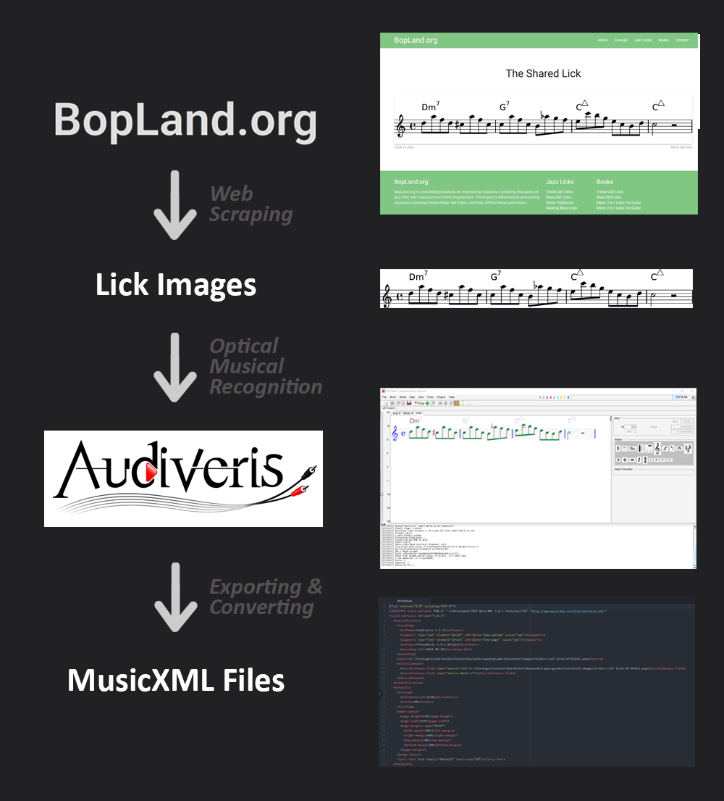

# BoplandLicksForDevelopers

[![CC BY-SA 4.0][cc-by-sa-shield]][cc-by-sa]

## Description
This repository contains a collection of musicXML jazz licks (melodic segments) that were retrived from the [BopLand](https://www.bopland.org/) website.

The licks are classified in 4 category :
- bass-clef-licks
- guitar-licks
- treble-clef-licks
- walking-bass-lines

Repository organisation :

- `lick/image` contains the `.png` partition version of the licks
- `lick/jsonTag` contains for each category a json files providing tagging informations for every licks
- `lick/musicXML` contains the acctual `.xml` files providing the musical datas

## Why / How
When I tried to contact BopLand devs to ask if they could share their lick librairy in a more developer friendly format, I got no answer. So I decided to retrive them myself and share them in case someone else had the same idea.

On the website, the licks are stored as .png partitions. To retrive the musical data from these images the Optical Music Recognition software [Audiveris](https://github.com/Audiveris/audiveris) was used.

Python was used to automate all this process, I made a bunch of scripts that took care of the web scraping, the Audiveris mxl export and the mxl to xml convertion.

This collection is licensed under a
[Creative Commons Attribution-ShareAlike 4.0 International License][cc-by-sa].

[![CC BY-SA 4.0][cc-by-sa-image]][cc-by-sa]

[cc-by-sa]: http://creativecommons.org/licenses/by-sa/4.0/
[cc-by-sa-image]: https://licensebuttons.net/l/by-sa/4.0/88x31.png
[cc-by-sa-shield]: https://img.shields.io/badge/License-CC%20BY--SA%204.0-lightgrey.svg
